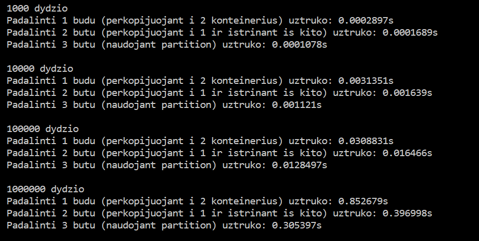

# OOP-Uzduotis-1

Programa skirta nuskaityti studentų duomenims (vardas, pavardė, namų darbų pažymiai, egzamino pažymys), apskaičiuoti ir išvesti kiekvieno studento galutinį pažymį.

## Įdiegimo instrukcija


### Naudojimosi instrukcija


## Versijų istorija


## [0.5 versija](https://github.com/dovmar/OOP-Uzduotis-1/releases/tag/v0.5)

- Programa pritaikyta veikti ir naudojant std::list konteinerį.


## [0.4 versija](https://github.com/dovmar/OOP-Uzduotis-1/releases/tag/v0.4)

 
- Programa gali padalinti studentus į dvi dalis (priklausomai nuo to ar jų galutinis pažymys didesnis ar mažesnis už pasirinktą) ir išvesti studentus į du atskirus failus. Pvz. nuskaitome failą studentai.txt ir padaliję išvedame į atskirus failus:


- Su programa galima sugeneruoti duomenų failą su atsitiktiniais studentų duomenimis.


- Naudojant funkciją **visasLaikas()** galima sužinoti kiek laiko programa užtrunka vykdydama skirtingus žingsnius.


## [0.2 versija](https://github.com/dovmar/OOP-Uzduotis-1/releases/tag/v0.2)


- Programa gali nuskaityti/išvesti studentų duomenys iš failų.  

- Programoje nereikia rankiniu būdu įvesti stulpelių kiekio ir patys stulpelių vardai nėra svarbūs.

- Norint nuskaityti studentų duomenis iš failo, naudoti funciją **nuskaitytiFaila()**. Pvz. jeigu mūsų tinkamo formato failo vardas "studentai.txt":

- Studentų rezultatai įrašomi į failą su **isvestiFaila()**.

- Duomenys nebūtinai turi būti ir įvedami iš failo ir rezultatai išvedami į failą. Pvz. duomenis galima įvesti ranka ir tada rezultatus įrašyti į failą arba atvikščiai.


## [0.1 versija](https://github.com/dovmar/OOP-Uzduotis-1/releases/tag/v0.1)

- Programa skirta rankiniu būdu įvesti studentų duomenims ir apskaičiavus jų galutinį pažymį išvesti rezultatus į ekraną.

* Pateiktos dvi programos versijos:
 * main.cpp naudoja C masyvus
 * main_vector.cpp naudoja std::vector konteinerį

- Programa gali apskaičiuoti galutinį pažymį naudojant medianą arba vidurkį.


## Programos spartos analizė

Sparos matavimui naudotos sistemos duomenys:

```
Processor:	Intel(R) Core(TM) i5-8250U CPU @ 1.60GHz, 1801 Mhz, 4 Core(s)
Memory:    6.00GB
Storage:  	WDC PC SN520 SDAPMUW-256G-1101 SSD

```

Skirtingų programos atliekamų veiksmų trukmė:


Programos sparta naudojant **std::vector**:


Programos sparta naudojant **std::list**:


Studentų padalijimo į dvi dalis trukmė, naudojant skirtingas dalijimo strategijas:


