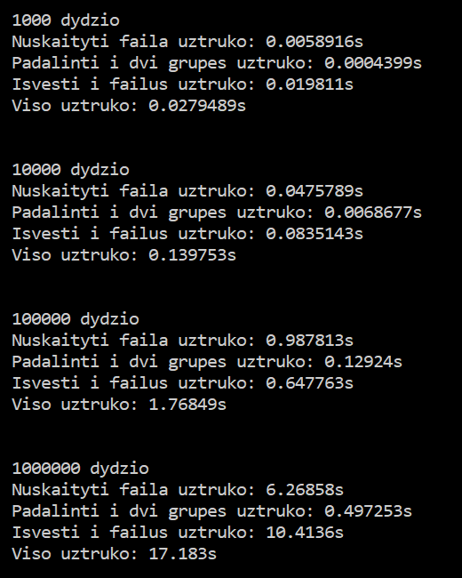
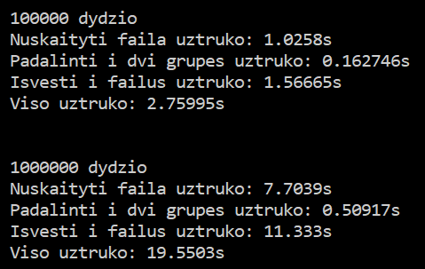
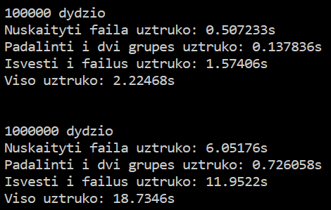

# OOP-Uzduotis-2

Programa skirta nuskaityti studentų duomenims (vardas, pavardė, namų darbų pažymiai, egzamino pažymys), apskaičiuoti ir išvesti kiekvieno studento galutinį pažymį.


## 3.0 versija

- Pridėtas įdiegimo failas Windows OS

## Įdiegimo instrukcija

Windows OS

 - Atsisųsti [naujausią versiją](https://github.com/dovmar/OOP-Uzduotis-3/releases/latest/download/OOP-Uzduotis-2.msi).
 - Įdiegti.

Bet kokia OS

 - Atsiųsti [naujausią versiją](https://github.com/dovmar/OOP-Uzduotis-ę/releases/).
 - Sukompiliuoti programą naudojant CMakeLists.txt failą.
 - Paleisti programą.


## Versijų istorija

## [2.0 versija](https://github.com/dovmar/OOP-Uzduotis-2/releases/tag/v2.0)

- Pridėtas doxygen aprašas klasėms
- Sukurti keli unit testai naudojant Google Test framework'ą

## [1.5 versija](https://github.com/dovmar/OOP-Uzduotis-2/releases/tag/v1.5)

- Sukurta abstrakti Žmogus klasė
- Supaprastintas kelių funckijų kodas naudojantis klasių galimybėmis
- Ištaisytas anksčiau minėtas bug'as

## [1.2 versija](https://github.com/dovmar/OOP-Uzduotis-2/releases/tag/v1.2)

- Programos versija naudojanti Studento klasę, vietoje struktūrų.

   **DĖMESIO!** Į šį releas'ą pateko bug'as - Studento klasės copy konstructorius neperkopijuoja studento galutinių pažymių, todėl visų studentų pažymiai tampa lygus 0.

    Norint to išvengti reikia pakeisti failo studentas.cpp 87 eilutę į:

```c++
Studentas::Studentas(const Studentas& stud) : vardas_{ stud.vardas_ }, pavarde_{ stud.pavarde_ },
nd_{ stud.nd_ }, egzaminas_{ stud.egzaminas_ } {}

```

## [1.0 versija](https://github.com/dovmar/OOP-Uzduotis-1/releases/tag/v1.0)

- Naujausia programos versija naudojanti struktūras.

## Programos spartos analizė

Sparos matavimui naudotos sistemos duomenys:

```
Processor: Intel(R) Core(TM) i5-8250U CPU @ 1.60GHz, 1801 Mhz, 4 Core(s)
Memory:    6.00GB
Storage:   WDC PC SN520 SDAPMUW-256G-1101 SSD

```

Programos sparta naudojant Studentas struktūrą:


Programos sparta naudojant Studentas klasę:




Programos sparta naudojant O1 flag'ą:




Programos sparta naudojant O2 flag'ą:



