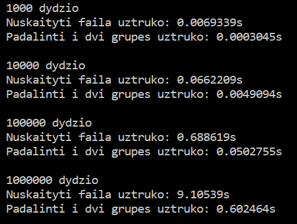

# OOP-Uzduotis-1

Programa skirta nuskaityti studentų duomenims (vardas, pavardė, namų darbų pažymiai, egzamino pažymys), apskaičiuoti ir išvesti kiekvieno studento galutinį pažymį.

[0.4 versija](https://github.com/dovmar/OOP-Uzduotis-1/releases/tag/v0.4)

[0.2 versija](https://github.com/dovmar/OOP-Uzduotis-1/releases/tag/v0.2)

[0.1 versija](https://github.com/dovmar/OOP-Uzduotis-1/releases/tag/v0.1)

### Naujausios versijos naudojimosi instrukcija

Programa gali veikti ir su std::list konteineriu. Kokį konteinerį naudoti pasirinkti header.h faile:

```c++
using container = list<duomuo>;
``` 
arba

```c++
using container = vector<duomuo>
```

Programos sparta naudojant **std::vector**:


Programos sparta naudojant **std::list**:



### V0.4 naudojimosi instrukcija
 
Programa gali padalinti studentus į dvi dalis (priklausomai nuo to ar jų galutinis pažymys didesnis ar mažesnis už pasirinktą) ir išvesti studentus į du atskirus failus. Pvz. nuskaitome failą studentai.txt ir padaliję išvedame į atskirus failus:

```c++
nuskaitytiFaila(Stud,"studentai.txt");
for (int i = 0; i < Stud.size(); i++) {
    naudojantVidurki(Stud, i);
    naudojantMediana(Stud, i);
    }
Stud2 = padalinti(Stud);
isvestiFaila(Stud, "islaike.txt");
isvestiFaila(Stud2, "neislaike.txt");
```

Su programa galima sugeneruoti duomenų failą su atsitiktiniais studentų duomenimis.

```c++
sugeneruotiFaila(1000, 10, "generuotas1000.txt");
```

Naudojant funkciją **visasLaikas()** galima sužinoti kiek laiko programa užtrunka vykdydama skirtingus žingsnius.

```c++
visasLaikas(Stud, Stud2,"generuotas1000.txt")
```

Programos veikimo spartos analizė:


### V0.2 naudojimosi instrukcija

Programa gali nuskaityti/išvesti studentų duomenys iš failų.  

Programoje nereikia rankiniu būdu įvesti stulpelių kiekio ir patys stulpelių vardai nėra svarbūs.

Norint nuskaityti studentų duomenis iš failo, naudoti funciją **nuskaitytiFaila()**. Pvz. jeigu mūsų tinkamo formato failo vardas "studentai.txt":
```c++
nuskaitytiFaila(Stud,n,"studentai.txt");
```

Studentų rezultatai įrašomi į failą su **isvestiFaila()**.
```c++
isvestiFaila(Stud,n);
```

Duomenys nebūtinai turi būti ir įvedami iš failo ir rezultatai išvedami į failą. Pvz. duomenis galima įvesti ranka ir tada rezultatus įrašyti į failą arba atvikščiai.
```c++
int n;
vector <duomuo> Stud;
ivedimas(Stud,n);
isvestiFaila(Stud,n);
```

### V0.1 naudojimosi instrukcija

Programa skirta rankiniu būdu įvesti studentų duomenims ir apskaičiavus jų galutinį pažymį išvesti rezultatus į ekraną.

Pateiktos dvi programos versijos:
- main.cpp naudoja C masyvus
- main_vector.cpp naudoja std::vector konteinerį

Galimi variantai kaip apskaičiuoti galutinį pažymį:

```c++
isvedimas(Stud, n, "(Med.)");
```

```c++
isvedimas(Stud, n, "(Vid.)");
```
